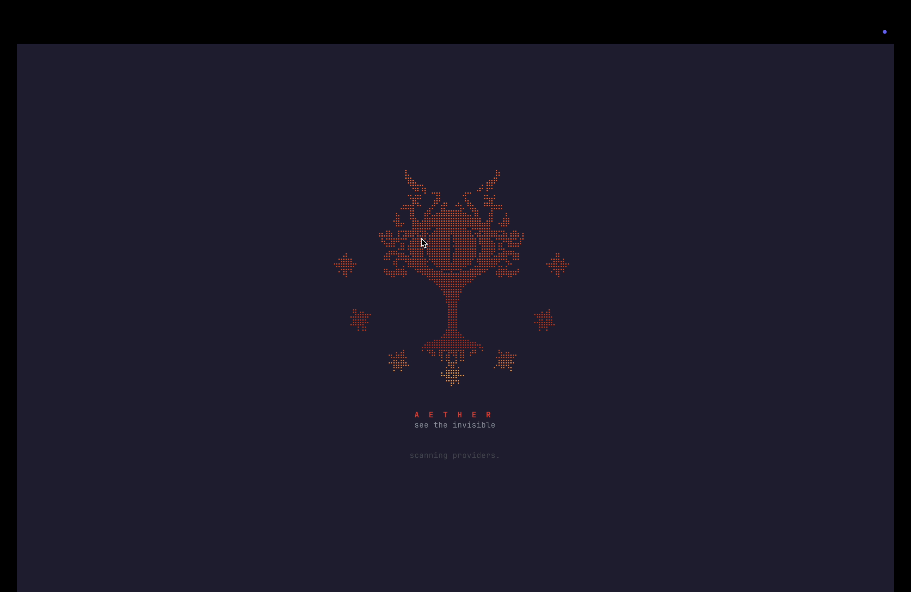
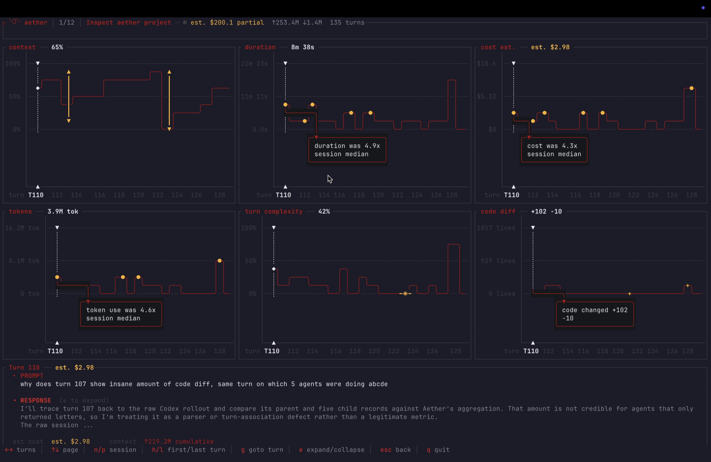
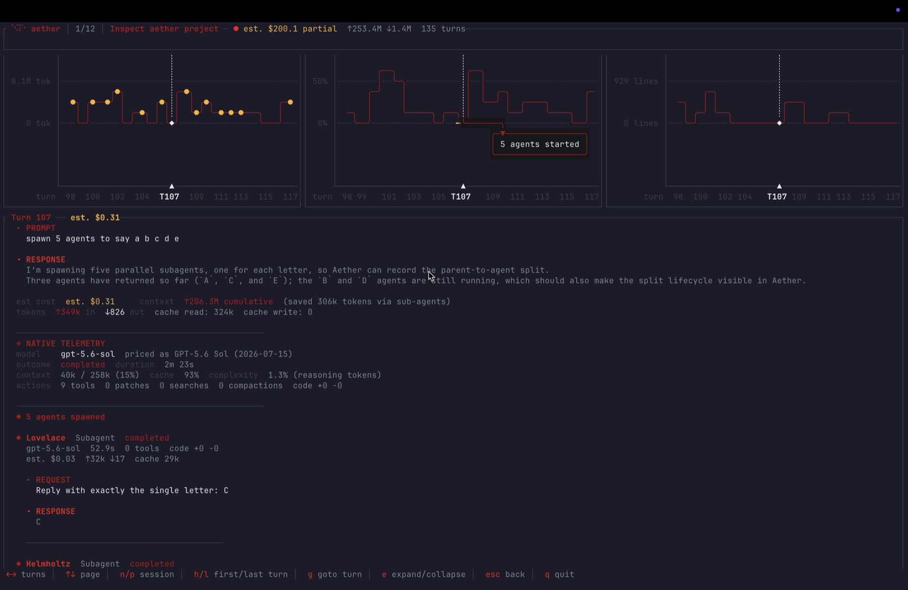

<div align="center">

# aether

### See the invisible.

<p><strong>Local, live observability for Claude Code and Codex.</strong><br>
Understand context, cost, latency, complexity, tools, code changes, compactions, and agents from one terminal.</p>

<p>
  <a href="https://aether.haciensus.com"><strong>Website</strong></a>
  &nbsp;&middot;&nbsp;
  <a href="#quick-start"><strong>Quick start</strong></a>
  &nbsp;&middot;&nbsp;
  <a href="https://github.com/connectchiragg/aether/releases/latest"><strong>Releases</strong></a>
</p>

<p><a href="https://github.com/connectchiragg/aether/releases/latest"></a> <a href="LICENSE"></a> <a href="https://www.rust-lang.org/"></a> <a href="#quick-start"></a></p>

<br>

<a href="https://aether.haciensus.com"></a>

</div>

https://github.com/user-attachments/assets/c550f7cc-3017-4a40-a6e3-76684fa2aa2a

<div align="center">
  <sub>A silent product tour, captured in a standard terminal.</sub>
</div>

---

Coding agents already write detailed local traces. Aether turns those traces into an operational view you can use while the work is happening.

It reads the native session files produced by Claude Code and Codex, groups chats by project, keeps sub-agents inside their parent turn, and renders synchronized telemetry in a fast terminal UI. There is no SDK to instrument, API key to configure, or cloud dashboard to maintain.

## Quick Start

Install, trust the Aether formula, and watch:

```bash
brew tap connectchiragg/tap
brew trust --formula connectchiragg/tap/aether
brew install connectchiragg/tap/aether
aether watch
```

Homebrew 6 requires explicit trust before loading third-party formulae. Formula-level trust
authorizes only Aether, not every formula that may later be added to the tap.

`aether watch` discovers every supported provider automatically and labels detected providers
as `present · tracked`. It does **not** install hooks, modify provider transcripts, require API
keys, or make model calls.

### Install Without Homebrew

The release installer supports macOS and Linux on Apple Silicon/ARM64 and x86-64:

```bash
curl -fsSL https://raw.githubusercontent.com/connectchiragg/aether/master/install.sh | bash
```

## What Aether Gives You



| View | What it answers |
|---|---|
| **Context** | How full is the active model window, and where did compaction reduce it? |
| **Duration** | Which turns are slow or unusually far above the session median? |
| **Estimated cost** | What is the API-equivalent token cost of each turn and session? |
| **Tokens** | How much input, output, cache, and reasoning work did the provider report? |
| **Turn complexity** | How much native reasoning or thinking work did this turn require on a stable 0-100 scale? |
| **Code diff** | Which successful turns added, removed, created, or deleted code? |
| **Input work** | What occupied the model input for this user request? |
| **Agent detail** | Which agents were spawned, what were they asked to do, and what did they return? |
| **Native telemetry** | Which model, tools, searches, patches, outcomes, and compactions were involved? |

The six timeline graphs share one turn range and selection. Move left or right once and every metric remains aligned, making cost, latency, context, complexity, and code impact directly comparable.

## Understand Input Work

Every selected turn includes a left-to-right attribution tree beneath the timeline graphs:

```text
user request  ->  category  ->  named source
```

Each level is sorted by token contribution, largest first. Every node shows tokens, percentage of the selected turn's input work, cost, and duration; estimates are marked explicitly.

| Category | Includes |
|---|---|
| **User prompt** | The current user request |
| **Context** | Retained material from previous turns outside the active compacted summary |
| **Compaction** | The active compacted summary, kept separate from ordinary context |
| **Tools & MCPs** | Model-visible tool definitions, calls, and results, grouped by useful tool identity |
| **Hooks** | Context injected by provider hooks |
| **Memory** | Provider-injected project or user memory |
| **Documents & KBs** | Direct attachments and native document injection |
| **Agents** | Agent instructions and returned summaries, grouped by agent purpose |
| **Provider runtime** | Base instructions, carried runtime state, formatting, and residual provider-managed input |

Compaction is intentionally a category-only node. Sources with repeated calls show the invocation count without exposing raw tool arguments, schemas, memory contents, or hook payloads.

### Exact Totals, Honest Attribution

Provider-emitted input totals are authoritative. Lower-level categories are deterministic estimates because Claude Code and Codex do not emit token counts for every individual prompt component.

- Exact native totals are displayed without `~` when available.
- Category and source allocations are marked `~`.
- Child cost and duration are allocated by input-token share and marked as estimates.
- Unknown models or missing native metrics remain unavailable rather than being guessed.
- Category totals always reconcile to the selected root.

## Keep Agents Inside Their Parent Turn

Sub-agents are work performed for a parent request, not unrelated chats. Aether renders them where they belong.



The collapsed turn view reports how many agents were spawned. Expand it to inspect each agent's instruction, response preview, model, outcome, duration, tokens, tools, cost estimate, and code impact. Agent sessions and provider hook activity do not pollute the top-level chat list.

## Sessions That Remain Recognizable

Aether uses provider-native titles when available, falls back to the first genuine user request, and groups sessions by project. Synthetic startup instructions, hook records, and sub-agent rollouts are not promoted into standalone chats.

Sessions update incrementally while `aether watch` is running. Provider cards distinguish
`live · tracked`, `present · tracked`, and unavailable states with one watch command.

## Provider Support

### Claude Code

Aether reads native Claude Code JSONL sessions from `~/.claude/projects/` and understands:

- Native titles, projects, parent sessions, and nested agents
- Models, completion state, duration, tools, and outcomes
- Input, output, prompt-cache, and thinking-response usage
- Context utilization, compaction boundaries, and deterministic complexity
- Successful edits, created/deleted files, hooks, memory, and attachments

Repeated Claude content records sharing a native message ID are counted once.

### Codex

Aether reads Codex rollouts from `~/.codex/sessions/` and titles from the Codex session index. It understands:

- Native task titles, projects, parent turns, and sub-agents
- Models, context windows, task outcomes, and duration
- Input, cached input, output, and reasoning tokens
- Tools, patches, web searches, compactions, hooks, memory, and attachments
- Applied unified diffs, created/deleted files, and code-line impact

## How It Works

```text
Claude JSONL ----\
                  +--> provider parsers --> normalized sessions --> live TUI
Codex rollouts --/             |
                               +--> attribution ledger
                               +--> versioned pricing catalog
```

1. Aether discovers supported providers and their native session files.
2. Provider-specific parsers reconstruct sessions, turns, requests, and relationships.
3. Sub-agents, hooks, compactions, and documents are attached to their native parent turn.
4. Provider totals are normalized; lower-level attribution is reconciled deterministically.
5. The watcher incrementally refreshes the currently open session as files change.

Provider JSONL remains the source of truth. Aether does not need a hosted database.

## Navigation

### Providers and Sessions

| Key | Action |
|---|---|
| `Arrow keys` | Move through providers |
| `Up` / `Down` | Move through sessions |
| `Enter` | Open the selected provider or session |
| `r` | Rename the selected session locally |
| `Esc` | Go back |
| `q` or `Ctrl-C` | Quit |

### Turn Explorer

| Key | Action |
|---|---|
| `Left` / `Right` | Move every graph to the previous or next turn |
| `h` / `Home` | Jump to the first turn |
| `l` / `End` | Jump to the latest turn |
| `g`, number, `Enter` | Go to a specific turn |
| `n` / `p` | Open the next or previous session |
| `j` / `k` or `Down` / `Up` | Scroll the complete page |
| `e` | Expand or collapse prompt, response, and agent details |
| Mouse / trackpad | Scroll the complete page |
| `Ctrl-L` | Force a clean terminal redraw |
| `Esc` | Return to the session list |

## Cost and Complexity

Aether prices known models using the versioned catalog in [`src/model/pricing.json`](src/model/pricing.json). The catalog supports model aliases, context windows, prompt-cache semantics, date-effective pricing, and model-specific long-context rules.

Cost is an API-equivalent token estimate, not a provider invoice. Local Codex rollouts do not expose charges against a ChatGPT subscription or credits balance. Tool fees, regional pricing, subscription allocation, and unknown models are not invented; sessions with incomplete pricing are labeled `partial`.

Turn complexity normalizes provider-emitted reasoning tokens, or Claude thinking-output usage when exact reasoning tokens are unavailable, onto a capped 0-100 scale. It is a comparison signal, not a quality score.

## Privacy by Construction

- Session data is read and processed locally.
- Aether has no hosted telemetry backend.
- No Claude or OpenAI API key is required.
- No prompt, response, source file, or metric is uploaded.
- No additional LLM is called to generate titles, metrics, or attribution.
- Provider transcripts are never modified.

## Troubleshooting

**No sessions appear**

Confirm that Claude Code or Codex has created at least one local session. Aether picks it up
automatically on its next scan.

**The terminal looks incomplete after sleep or resize**

Press `Ctrl-L` to force an immediate redraw. Aether also detects resume-sized event gaps and repaints automatically.

**A cost is unavailable**

The session may not expose a model ID, or the model may not yet exist in the pricing catalog. Aether leaves the value unknown instead of applying another model's price.

## Build From Source

```bash
git clone https://github.com/connectchiragg/aether.git
cd aether
cargo build --release
./target/release/aether watch
```

Run the test suite with:

```bash
cargo test
```

## Uninstall

Homebrew installations require one command:

```bash
brew uninstall aether
```

Direct installations also require one command:

```bash
curl -fsSL https://raw.githubusercontent.com/connectchiragg/aether/master/uninstall.sh | bash
```

## Contributing

Issues and pull requests are welcome, especially for:

- Additional coding-agent providers
- New provider-native telemetry fields
- Official model pricing updates
- Parser fixtures for provider format changes
- Terminal compatibility and rendering improvements

Keep new metrics deterministic, preserve provider-native totals, and label estimates explicitly.

## License

[MIT](LICENSE)

<div align="center">
  <p><a href="https://aether.haciensus.com"><strong>aether.haciensus.com</strong></a></p>
  <sub>Built for people who want to understand what their agents are actually doing.</sub>
</div>
